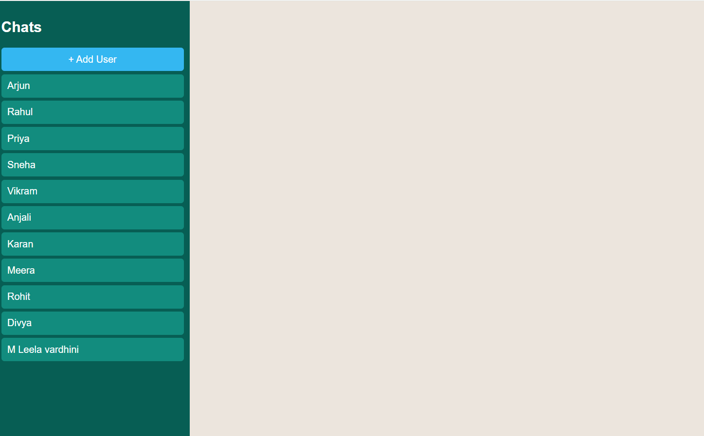
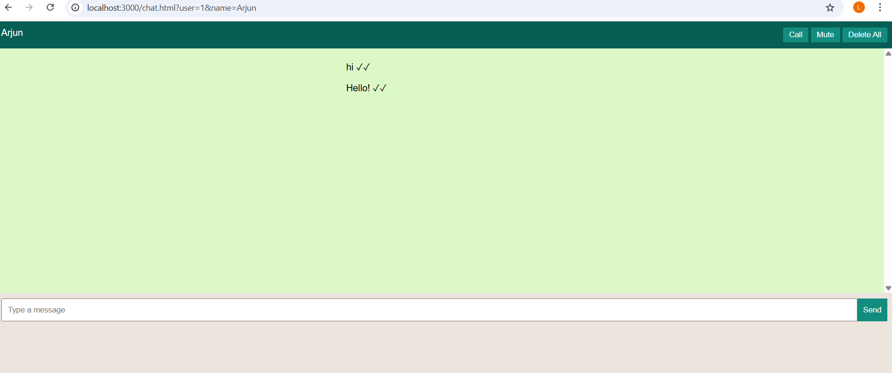
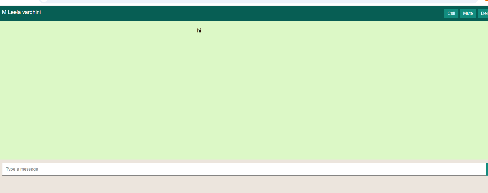
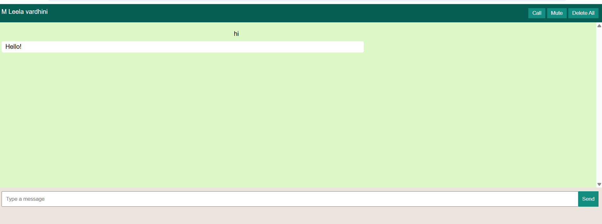
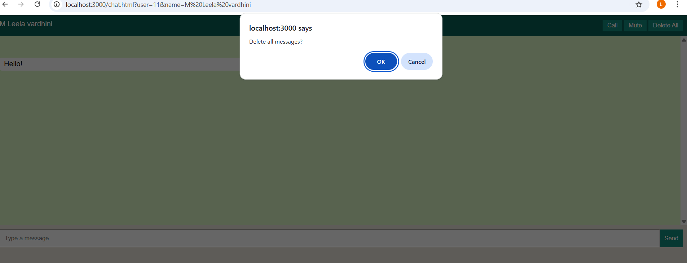
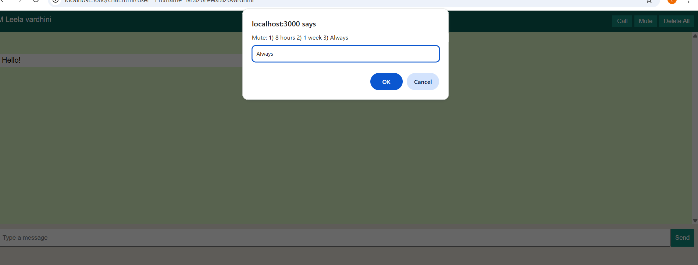

# 💬 Chat Application | Full-Stack WhatsApp-Inspired Messaging Platform

> A full-stack WhatsApp-inspired messaging platform built using **HTML, CSS, JavaScript, Node.js, Express.js, and MySQL**.


---

## 📖 Project Overview

Chat Application is a full-stack web application inspired by WhatsApp that enables users to manage contacts, exchange one-to-one messages, receive automatic replies, delete messages or conversations, and mute notifications.

The project demonstrates frontend-backend integration, RESTful APIs, CRUD operations, responsive UI design, and MySQL database integration.

---

## ✨ Features

- 📱 WhatsApp-inspired responsive interface
- 👥 Contact management
- 💬 One-to-one messaging
- 🤖 Automatic reply simulation
- 🗑️ Delete messages
- 🧹 Delete conversations
- 🔕 Mute conversations
- 💾 MySQL database integration
- ⚡ Responsive user interface

---

## 📸 Screenshots

| Home | Chat |
|------|------|
|  |  |

| Send Message | Auto Reply |
|--------------|------------|
|  |  |

| Delete Message | Delete Conversation |
|----------------|---------------------|
|  |  |

| Mute Settings |
|---------------|
|  |

---

## 🏗️ System Architecture

```text
User
   │
HTML • CSS • JavaScript
   │
HTTP Requests
   │
Node.js + Express.js
   │
REST APIs
   │
MySQL
   │
Updated Chat Interface
```

---

## 🛠️ Tech Stack

| Layer | Technologies |
|--------|--------------|
| Frontend | HTML5, CSS3, JavaScript |
| Backend | Node.js, Express.js |
| Database | MySQL |
| Tools | Git, GitHub, VS Code |

---

## 📂 Project Structure

```text
ChatApplication/
├── docs/
├── public/
├── screenshots/
├── server/
├── .env.example
├── package.json
├── README.md
└── LICENSE
```

---

## ⚙️ Installation

```bash
git clone https://github.com/leelamotakatla-08/chat-application.git

cd chat-application

npm install

npm start
```

Open:

```
http://localhost:3000
```

---

## 🚀 Future Enhancements

- 👥 Group Chats
- 🎤 Voice Messages
- 🖼️ Image & Video Sharing
- 😊 Emoji Reactions
- 🌙 Dark Mode
- 🔔 Push Notifications
- 🔒 End-to-End Encryption
- 🤖 AI Chat Assistant
- 🔍 Search Conversations

---

## 👩‍💻 Author

**Motakatla Leela Vardhini**

- GitHub: https://github.com/leelamotakatla-08
- LinkedIn: https://www.linkedin.com/in/leelavardhini-motakatla-952980389/

---

## 📄 License

This project is licensed under the MIT License.