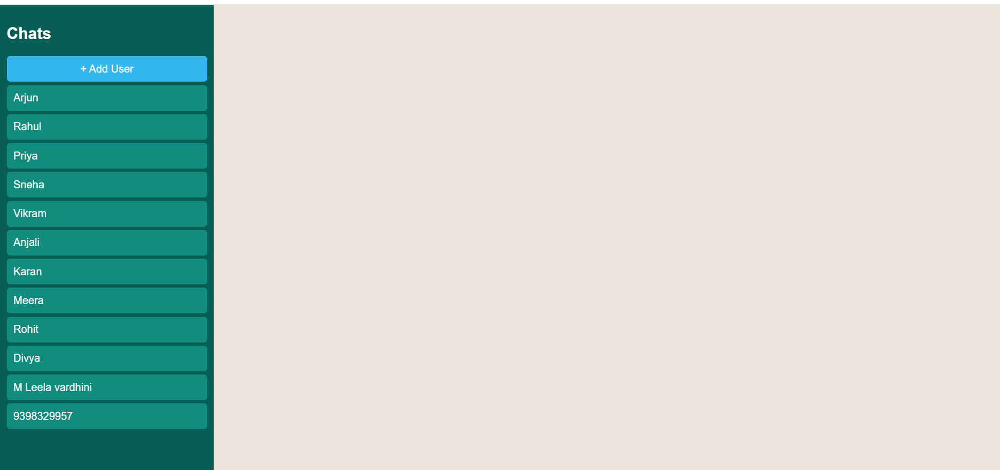
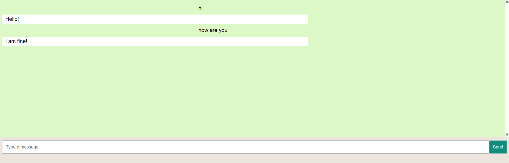
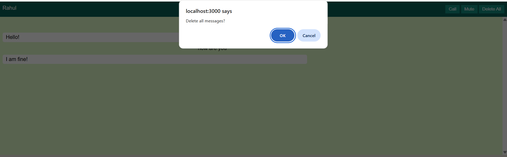

# 💬 Chat Application | Full-Stack WhatsApp-Inspired Messaging Platform

> A full-stack WhatsApp-inspired messaging platform built with **HTML, CSS, JavaScript, Node.js, Express.js, and MySQL** that enables one-to-one messaging, contact management, automated replies, message deletion, and conversation muting through RESTful APIs.


---

# 📖 Project Overview

Chat Application is a full-stack web application inspired by WhatsApp that provides a seamless one-to-one messaging experience. Users can manage contacts, exchange messages, receive automated replies, delete individual messages or complete conversations, and mute notifications for configurable durations.

The project demonstrates frontend-backend integration, RESTful API development, CRUD operations, asynchronous communication, responsive UI design, and relational database management using MySQL.

---

# 🌟 Project Highlights

- Built a full-stack chat application inspired by WhatsApp.
- Designed responsive frontend using HTML, CSS, and JavaScript.
- Developed RESTful APIs using Node.js and Express.js.
- Integrated MySQL database for persistent storage.
- Implemented CRUD operations for contacts and messages.
- Simulated automatic replies using asynchronous JavaScript.
- Added conversation muting and message deletion features.

---

# 📸 Screenshots

| 🏠 Home Page | 💬 Chat Window |
|--------------|----------------|
|  |  |
| Displays all contacts and recent conversations. | Send messages, receive automatic replies, and view conversation history. |

| ➕ Add Contact | 🗑️ Delete Message |
|----------------|-------------------|
|  |  |
| Add new contacts using the contact management interface. | Delete individual messages from a conversation. |

| 🔕 Mute Conversation | 👥 Contact Management |
|----------------------|-----------------------|
|  |  |
| Mute conversations for 8 Hours, 1 Week, or Always. | Manage contacts and quickly start new conversations. |

---

# ✨ Key Features

- 📱 WhatsApp-inspired responsive interface
- 👥 Add and manage contacts
- 💬 One-to-one messaging
- 🤖 Automatic reply simulation
- 🗑️ Delete individual messages
- 🧹 Delete complete conversations
- 🔕 Mute conversations (8 Hours, 1 Week, Always)
- 💾 Persistent MySQL database
- ⚡ Responsive user experience

---
# 🏗️ System Architecture

```text
                 User
                   │
                   ▼
      HTML • CSS • JavaScript
                   │
             HTTP Requests
                   │
                   ▼
        Node.js + Express.js
                   │
             RESTful APIs
                   │
                   ▼
             MySQL Database
                   │
                   ▼
          Updated Chat Interface
```

---

# 🛠️ Tech Stack

| Layer | Technologies |
|--------|--------------|
| Frontend | HTML5, CSS3, JavaScript |
| Backend | Node.js, Express.js |
| Database | MySQL |
| Version Control | Git, GitHub |
| Development Tools | VS Code |

---

# 📂 Project Structure

```text
ChatApplication/
├── docs/
│   ├── Architecture.png
│   ├── DatabaseSchema.png
│   └── Workflow.png
│
├── public/
│   ├── css/
│   ├── images/
│   ├── js/
│   ├── chat.html
│   └── index.html
│
├── screenshots/
│
├── server/
│   ├── config/
│   ├── config.js
│   ├── db.js
│   └── server.js
│
├── .env.example
├── .gitignore
├── CHANGELOG.md
├── LICENSE
├── package.json
├── package-lock.json
└── README.md
```
---

# 🔌 REST API Endpoints
| Method | Endpoint | Description |
|---------|----------|-------------|
| GET | /users | Retrieve all contacts |
| POST | /users | Create a new contact |
| GET | /messages/:user1/:user2 | Retrieve the conversation between two users |
| POST | /messages | Send a message |
| DELETE | /messages/:id | Delete a message |
| POST | /messages/seen | Mark messages as seen |
| POST | /mute | Mute a user |

---

# 🗄️ Database Schema

## Users

| Column | Type |
|---------|------|
| id | INT (PK) |
| name | VARCHAR(100) |
| phone | VARCHAR(15) |

## Messages

| Column | Type |
|---------|------|
| id | INT (PK) |
| sender_id | INT (FK) |
| receiver_id | INT (FK) |
| message | TEXT |
| status | VARCHAR(20) |
| created_at | TIMESTAMP |

## Mute_Settings

| Column | Type |
|---------|------|
| id | INT (PK) |
| user_id | INT (FK) |
| muted_user_id | INT (FK) |
| mute_until | DATETIME |

---

# ⚙️ Installation

```bash
git clone https://github.com/leelamotakatla-08/ChatApplication.git

cd ChatApplication

npm install
```

Update the MySQL database credentials in `server.js` before starting the application.

Start the server:

```bash
npm start
```

Open your browser:

```
http://localhost:3000
```
---

# ✅ Tested Features

- Contact Management
- One-to-One Messaging
- Automatic Replies
- Message Deletion
- Conversation Muting
- MySQL Data Persistence

---

# 🚀 Future Improvements

### Messaging

- Group Chats
- Voice Messages
- Image & Video Sharing

### User Experience

- Emoji Reactions
- Typing Indicator
- Dark Mode
- Push Notifications

### Security

- Read Receipts
- End-to-End Encryption

### AI Features

- AI Chat Assistant
- Smart Reply Suggestions

### Search

- Search Conversations

---

# 👩‍💻 Author

**Leela Vardhini Motakatla**

- GitHub: [@leelamotakatla-08](https://github.com/leelamotakatla-08)
- LinkedIn: [Leela Vardhini Motakatla](https://www.linkedin.com/in/leelavardhini-motakatla-952980389/)

---

# 📄 License

This project is licensed under the MIT License. See the `LICENSE` file for details.