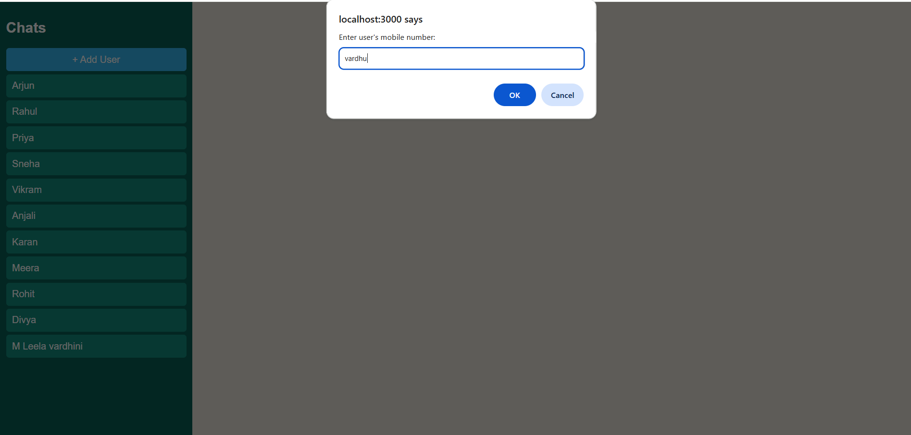
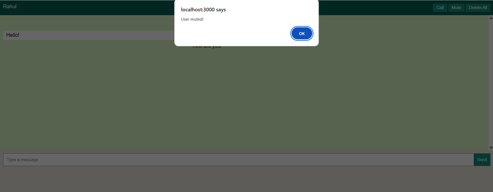

# 💬 Chat Application | Full-Stack WhatsApp-Inspired Messaging Platform

> A WhatsApp-Inspired Smart Messaging Platform built using **HTML, CSS, JavaScript, Node.js, Express.js, and SQLite**.


---

# 📖 Project Overview

Chat Application is a full-stack web-based messaging platform inspired by WhatsApp, designed to provide a seamless one-to-one messaging experience. Users can add contacts using their name and phone number, open dedicated chat pages, exchange messages, receive automatic replies, delete individual messages or complete conversations, and mute notifications for configurable durations.

The project demonstrates practical implementation of frontend and backend integration, CRUD operations, event-driven programming, RESTful communication, database management, and responsive web design using HTML, CSS, JavaScript, Node.js, Express.js, and SQLite. 

---

# ✨ Key Highlights

- 📱 WhatsApp-inspired user interface
- 👥 Contact management using name and phone number
- 💬  Dedicated one-to-one chat interface 
- 🤖 Automatic reply simulation
- 🗑️ Delete individual messages or complete conversations
- 🔕 Mute conversations (8 Hours, 1 Week, Always)
- 💾 SQLite database integration
- ⚡ Responsive and user-friendly design

---

# 🚀 Features

| Feature | Description |
|----------|-------------|
| ➕ Add User | Add a new contact using their name and phone number |
| ❌ Delete User | Remove a contact by performing a long-press action |
| 💬 One-to-One Chat | Open a dedicated chat page and exchange messages with individual contacts |
| 🤖 Automatic Replies | Generate automated responses to simulate real conversations |
| 🗑️ Delete Message | Delete individual messages from a conversation |
| 🧹 Delete Conversation | Delete the complete conversation with a selected contact |
| 🔕 Mute User | Mute notifications for **8 Hours**, **1 Week**, or **Always** |
| 📱 Responsive UI | Clean, responsive, WhatsApp-inspired interface |

--- 


# 🛠️ Tech Stack

| Category | Technologies |
|----------|--------------|
| Frontend | HTML5, CSS3, JavaScript |
| Backend | Node.js, Express.js |
| Database | SQLite |
| Development Tools | VS Code, Git, GitHub |

---

# 🧠 Skills Demonstrated

- Full-Stack Web Development
- CRUD Operations
- Client-Server Architecture
- REST API Integration
- Express.js Routing
- SQLite Database Integration
- Database Management
- Event-Driven Programming
- Asynchronous JavaScript
- DOM Manipulation
- Responsive UI Design
- Problem Solving
- Clean Code Organization 

---

# 📂 Project Structure

```text
ChatApplication/
│
├── public/
│   ├── css/
│   │   └── style.css
│   ├── js/
│   │   ├── script.js
│   │   ├── chat.js
│   │   └── users.js
│   ├── images/
│   │   ├── logo.png
│   │   ├── avatars/
│   │   └── icons/
│   ├── index.html
│   └── chat.html
│
├── server/
│   ├── config/
│   │   └── config.js
│   ├── db.js
│   └── server.js
│
├── screenshots/
├── docs/
├── README.md
├── package.json
├── package-lock.json
├── .gitignore
├── LICENSE
├── .env.example
└── CHANGELOG.md 
```

---

# 📸 Screenshots

The following screenshots demonstrate the key features and user interface of the Chat Application.

### 🏠 Home Screen


---

### 💬 Chat Page 


---

### ➕ Add User



---

### 🤖 Automatic Reply


---

### 🗑️ Delete Message


---

### 🔕 Mute User



---

# 🏗️ System Architecture

```text
                    User
                      │
                      ▼
        HTML • CSS • JavaScript
                      │
             HTTP Requests
                      │
                      ▼
          Node.js + Express.js
                      │
                      ▼
             SQLite Database
                      │
                      ▼
          Updated Chat Page 
```

---

# ⚙️ Installation

### Clone the repository

```bash
git clone https://github.com/leelamotakatla-08/ChatApplication.git
```

### Navigate to the project folder

```bash
cd ChatApplication
```

### Install dependencies

```bash
npm install
```

### Start the application

```bash
npm start
```

### Open in your browser

```text
http://localhost:3000
```

---

# 🚧 Challenges Faced

- Designing a WhatsApp-like user interface
- Managing dynamic chat updates
- Implementing automatic reply functionality
- Handling message deletion efficiently
- Managing mute functionality with multiple duration options
- Organizing frontend and backend components effectively

---
# 🔮 Future Enhancements

### Messaging
- 👥 Group Chats
- 🎤 Voice Messages
- 🖼️ Image Sharing
- 🎥 Video Sharing

### User Experience
- 😊 Emoji Reactions
- ⌨️ Typing Indicator
- 🌙 Dark Mode
- 🔔 Push Notifications

### Security
- 🔒 End-to-End Encryption
- ✔️ Read Receipts

### AI Features
- 🤖 AI Chat Assistant
- 💡 Smart Reply Suggestions

### Search
- 🔍 Search Conversations 


---

# 📊 Project Status

| Status | Value |
|--------|-------|
| Project | ✅ Completed |
| Type | Full-Stack Web Application |
| Platform | Web |
| Database | SQLite |
| Purpose | Portfolio & Learning Project |

---

# 👩‍💻 Developer

**Motakatla Leela Vardhini**

🎓 **B.Tech – Computer Science and Engineering**

🏫 **Vel Tech Rangarajan Dr. Sagunthala Institute of Science and Technology**

📈 **CGPA:** 9.11

🎓 **Graduation Year:** 2027

## 💻 Technical Skills

- Java
- Data Structures & Algorithms
- HTML5
- CSS3
- JavaScript
- Node.js
- Express.js
- SQLite
- MySQL
- DBMS
- Operating Systems
- Computer Networks
- AWS

🎯 **Career Goal**

Aspiring Software Engineer specializing in **Full-Stack Web Development** and **Java Backend Development**.
---

# 📬 Contact

- 📧 **Email:** leelamotakatla@gmail.com

- 💼 **LinkedIn:** [linkedin.com/in/leelavardhini-motakatla-952980389](https://www.linkedin.com/in/leelavardhini-motakatla-952980389/)

- 💻 **GitHub:** [github.com/leelamotakatla-08](https://github.com/leelamotakatla-08)
---

# ⭐ Support

If you found this project useful or interesting, consider giving it a ⭐ on GitHub. Your support is appreciated!